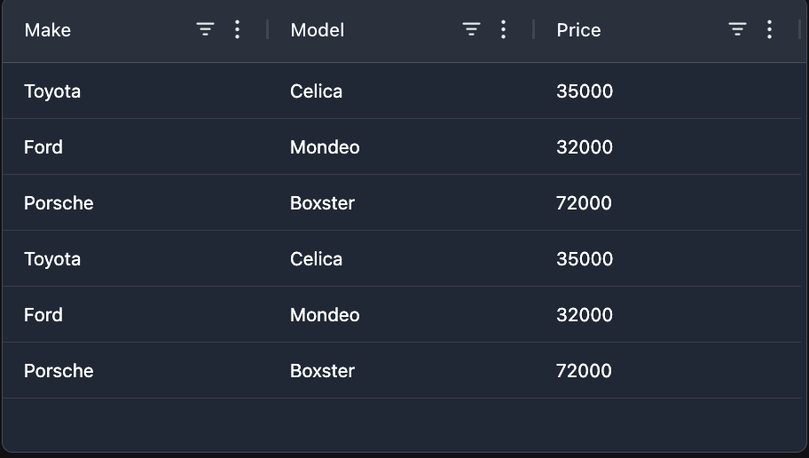

# AGGrid for Reflex

This package provides a Reflex component wrapping the AGGrid library.



> [!WARNING]
> As it is a WorkInProgress (WIP), only some parts of the AGGrid library features are wrapped, but it should be enough for most use cases.

## Installation

```bash
pip install reflex-ag-grid-ce
```

## Usage

```python
from reflex_ag_grid_ce import ag_grid_ce
```

## Helpers tools

Some implementation is offered for DataSource and handlers.

```python
from reflex_ag_grid_ce.data_source import DataSource
from reflex_ag_grid_ce import handlers
```

## Simple Example

```python
import reflex as rx
from reflex_ag_grid_ce import ag_grid_ce
import pandas as pd


df = pd.read_csv(
    "https://raw.githubusercontent.com/plotly/datasets/master/wind_dataset.csv"
)

column_defs = [
    ag_grid_ce.column_def(field="direction"),
    ag_grid_ce.column_def(field="strength"),
    ag_grid_ce.column_def(field="frequency"),
]


def ag_grid_simple():
    return ag_grid_ce(
        id="ag_grid_basic_1",
        row_data=df.to_dict("records"),
        column_defs=column_defs,
    )
```

Check out more documentation at [Reflex](https://reflex.dev/docs/library/tables-and-data-grids/ag-grid/).

## FAQ

- **The AGGrid feature I want is not available. What can I do?**

    This component is a partial wrapping of all the features of AGGrid. If you need a feature that is not available, 
    open an issue to request it. We will try to implement it when possible.

    If you can't wait for the team to implement it, you can also submit a PR with the feature you need.
